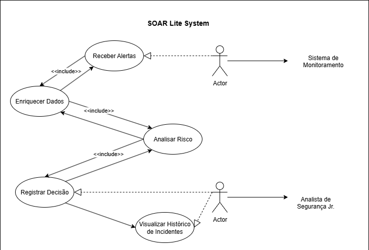
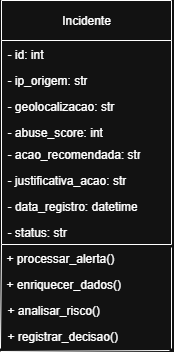
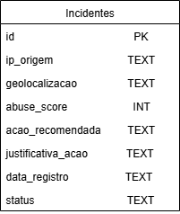

# 🛡️ SOAR Lite - Plataforma de Resposta a Incidentes com Python

Protótipo funcional de uma plataforma **SOAR** (*Security Orchestration, Automation and Response*) utilizando **Python, FastAPI e SQLite**. O sistema simula o fluxo completo de ingestão, enriquecimento e análise de alertas de segurança com automação de decisões baseadas em dados externos.

---

## 📚 Tabela de Conteúdo

- [🎯 Objetivo](#objetivo)
- [🧠 Visão Geral do Projeto](#visão-geral-do-projeto)
- [📁 Estrutura do Projeto](#estrutura-do-projeto)
- [⚙️ Tecnologias e Ferramentas](#tecnologias-e-ferramentas)
- [🔐 Instalação e Execução Local](#instalação-e-execução-local)
- [🚨 Como Usar a API](#como-usar-a-api)
- [🧠 Lógica de Decisão (Fase 4)](#lógica-de-decisão-fase-4)
- [🗃️ Exemplo de Registro no Banco](#exemplo-de-registro-no-banco)
- [📊 Diagramas do Projeto](#diagramas-do-projeto)
- [🐞 Tratamento de Erros](#tratamento-de-erros)
- [✅ Status do Projeto](#status-do-projeto)
- [🌱 Próximos Passos](#próximos-passos)
- [🤝 Autor](#autor)
- [📜 Licença](#licença)
- [📎 Referências](#referências)

---

## 🎯 Objetivo

Aumentar a capacidade de detectar, analisar e reagir a incidentes de forma **semi-automatizada**, utilizando APIs públicas, lógica condicional clara e banco de dados leve.

---

## 🧠 Visão Geral do Projeto

- 🔐 Recebe alertas contendo IPs suspeitos via API REST  
- 🧪 Valida o IP recebido  
- 🌍 Consulta **geolocalização** (`ip-api.com`)  
- 🧱 Consulta **reputação de IP** (`AbuseIPDB`)  
- ⚖️ Aplica lógica de decisão automatizada (bloquear, investigar, ignorar)  
- 🗂️ Armazena os incidentes processados em **SQLite**  
- 📦 Retorna resposta **estruturada em JSON**

---

## 📁 Estrutura do Projeto

```text
soar-lite/
├── main.py
├── .env
├── requirements.txt
├── src/
│   ├── ingestao.py
│   ├── enriquecimento.py
│   ├── decisor.py
│   ├── registro.py
├── data/
│   └── incidents.db
├── docs/
│   ├── Diagrama_ERD.png
│   ├── Diagrama_de_Classe.png
│   ├── Diagrama_casos_de_uso.png
└── tests/
```

---

## ⚙️ Tecnologias e Ferramentas

| Tecnologia     | Função                                         |
|----------------|------------------------------------------------|
| Python 3.x     | Linguagem principal                            |
| FastAPI        | Framework para criação da API REST             |
| SQLite         | Banco de dados leve, local                     |
| Requests       | Comunicação com APIs externas                  |
| ip-api.com     | API para obter geolocalização do IP            |
| AbuseIPDB      | API para obter score de reputação de IP        |
| python-dotenv  | Leitura de variáveis sensíveis (.env)          |

---

## 🔐 Instalação e Execução Local

### 1. Clone o repositório

```bash
git clone https://github.com/r0b3rTdk/soar-lite.git
cd soar-lite
```

### 2. Crie e ative o ambiente virtual

```bash
# Windows
python -m venv venv
.env\Scriptsctivate

# Linux/macOS
python3 -m venv venv
source venv/bin/activate
```

### 3. Instale as dependências

```bash
pip install -r requirements.txt
```

### 4. Configure o `.env`

Crie um arquivo `.env` na raiz do projeto com:

```env
ABUSEIPDB_API_KEY=sua_chave_api
DATABASE_NAME=incidents.db
```

### 5. Inicialize o banco de dados

```bash
python src/registro.py
```

### 6. Rode o servidor FastAPI

```bash
uvicorn main:soar_API --reload
```

Acesse a documentação interativa da API:  
📎 [http://127.0.0.1:8000/docs](http://127.0.0.1:8000/docs)

---

## 🚨 Como Usar a API

### Endpoint: `POST /alerta`

#### Exemplo de Requisição:

```json
{
  "ip": "8.8.8.8"
}
```

#### Exemplo de Resposta:

```json
{
  "mensagem": "Alerta processado com enriquecimento.",
  "ip": "8.8.8.8",
  "status_validacao": "IP 8.8.8.8 é um endereço IPv4 válido.",
  "geolocalizacao": "US",
  "detalhes_geolocalizacao": "Geolocalização obtida com sucesso.",
  "abuse_score": null,
  "detalhes_reputacao": "Reputação consultada com sucesso.",
  "acao_recomendada": "IGNORAR",
  "justificativa_acao": "pontuação de abuso zero, considerado seguro"
}
```

---

## 🧠 Lógica de Decisão (Fase 4)

| Condição                                                  | Ação Recomendada | Justificativa                                   |
|-----------------------------------------------------------|------------------|------------------------------------------------|
| País de risco (CN, RU, IR) **e** score > 50               | BLOQUEAR         | IP de alto risco                               |
| IP local (192.168.x.x, etc)                               | IGNORAR          | Endereço interno (RFC1918)                     |
| Score de abuso = 0                                        | IGNORAR          | IP limpo                                       |
| Score entre 1 e 50 **ou** geolocalização ausente          | INVESTIGAR       | Risco moderado ou falta de informação          |
| Qualquer outro caso                                       | INVESTIGAR       | Decisão prudente diante da incerteza           |

---

## 🗃️ Exemplo de Registro no Banco

| id | ip_origem   | geolocalizacao | abuse_score | acao_recomendada | justificativa_acao                 | data_registro        | status     |
|----|-------------|----------------|-------------|------------------|------------------------------------|-----------------------|------------|
| 1  | 8.8.8.8     | US             | 0           | IGNORAR          | pontuação de abuso zero, seguro    | 2025-07-21 01:30:00   | Processado |

---

## 📊 Diagramas do Projeto

### 📌 Diagrama de Casos de Uso


### 🧱 Diagrama de Classe


### 🧬 Diagrama ERD (Entidade-Relacionamento)


---

## 🐞 Tratamento de Erros

- ❌ IP inválido → `400 Bad Request`
- ⚠️ Falha na API `ip-api` → `geolocalizacao: null`
- ⚠️ Falha na API `AbuseIPDB` → `abuse_score: null`
- 🔐 Chaves de API protegidas via `.env`
- ✅ Sempre retorna um JSON informativo, mesmo em falhas parciais

---

## ✅ Status do Projeto

| Fase     | Descrição                                     | Status       |
|----------|-----------------------------------------------|--------------|
| Fase 1   | Planejamento e definição do problema           | ✅ Concluída |
| Fase 2   | Estruturação inicial do projeto                | ✅ Concluída |
| Fase 3   | Ingestão, validação e enriquecimento de IPs    | ✅ Concluída |
| Fase 4   | Decisão automática baseada em regras           | ✅ Concluída |
| Fase 5   | Compartilhamento público e README              | 🚧 Em progresso |
| Fase 6   | Integrações avançadas e automações             | ⏳ Pendente  |

---

## 🌱 Próximos Passos

- 📢 Publicar o projeto no GitHub
- 🚀 Deploy gratuito (Render, Replit, Deta)
- 📊 Criar dashboard com Streamlit
- 🔐 Autenticação com JWT
- 🔗 Integração com sistemas reais (ELK Stack, Filebeat)
- ⚡ Automação de bloqueios via script ou firewall

---

## 🤝 Autor

**Robert Emanuel**  
Desenvolvedor Python | Analista de Cibersegurança Jr.  
[🔗 LinkedIn](https://www.linkedin.com/in/robert-emanuel/) • [💻 GitHub](https://github.com/r0b3rTdk)

---

## 📜 Licença

Distribuído sob a licença MIT. Consulte `LICENSE` para mais informações.

---

## 📎 Referências

- [AbuseIPDB API Docs](https://docs.abuseipdb.com/)
- [IP-API Documentation](http://ip-api.com/docs/)
- [FastAPI](https://fastapi.tiangolo.com/)
