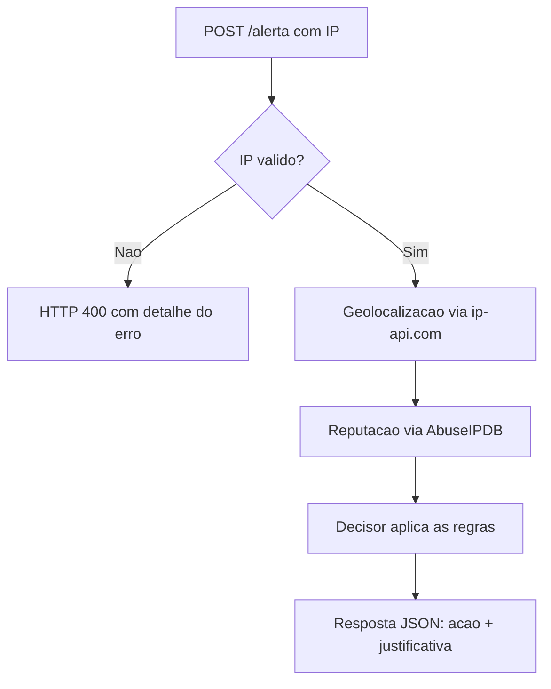

# SOAR Lite

Protótipo de um fluxo de triagem de alertas de segurança baseados em IP: recebe o IP via API REST, valida, consulta geolocalização e reputação em serviços externos e devolve uma ação recomendada (bloquear, investigar ou ignorar) com justificativa.

**Demo online:** [soar-lite-api.onrender.com/docs](https://soar-lite-api.onrender.com/docs) — está no plano gratuito do Render, então a primeira requisição depois de um tempo parado pode demorar alguns segundos para acordar.

---

## Problema Resolvido

Em um time de segurança, boa parte do trabalho de nível 1 é repetitivo: chega um IP suspeito, alguém precisa checar de onde ele vem, olhar o histórico de reputação e decidir se aquilo é ruído ou incidente de verdade.

Este projeto automatiza essa primeira triagem. Ele recebe o IP, busca geolocalização e score de abuso em APIs públicas, aplica um conjunto de regras e devolve uma decisão já com justificativa. Não substitui um analista, mas reduz o trabalho manual repetitivo antes de a decisão chegar em alguém.

---

## Como Funciona

O fluxo é sequencial e síncrono: cada etapa espera a anterior terminar antes de seguir.


```mermaid
flowchart TD
    A[POST /alerta com IP] --> B{IP valido?}
    B -- Nao --> C[HTTP 400 com detalhe do erro]
    B -- Sim --> D[Geolocalizacao via ip-api.com]
    D --> E[Reputacao via AbuseIPDB]
    E --> F[Decisor aplica as regras]
    F --> G[Resposta JSON: acao + justificativa]
```

Um ponto importante: se a geolocalização ou a reputação falharem (API fora do ar, sem chave configurada, etc.), o fluxo não é interrompido. O campo correspondente volta `null` e o decisor segue com o que tiver disponível. Preferi isso a derrubar a resposta inteira por causa de uma API de terceiro instável.

---

## Arquitetura

O código está dividido por responsabilidade, cada módulo cuidando de uma parte do pipeline:

- **`main.py`** — camada de exposição HTTP. Recebe a requisição, chama os módulos na ordem certa e monta a resposta final. Não tem lógica de negócio própria.
- **`src/ingestao.py`** — valida se o IP recebido é um IPv4/IPv6 sintaticamente válido, usando a lib padrão `ipaddress`. Não faz nenhuma chamada externa.
- **`src/enriquecimento.py`** — concentra toda a comunicação com serviços externos: geolocalização (`ip-api.com`) e reputação (`AbuseIPDB`). Cada função devolve um dicionário com `status` e `mensagem`, para que uma falha externa não derrube o restante do processamento.
- **`src/decisor.py`** — a única fonte de regras de negócio. Recebe dados já enriquecidos e devolve ação recomendada + justificativa. Não faz I/O de nenhum tipo, o que facilita testar isoladamente.
- **`src/registro.py`** — camada de persistência. Hoje cria a conexão com o SQLite e a tabela `incidents`, mas **não está conectada ao endpoint**: nenhuma chamada em `main.py` grava um incidente processado. É estrutura pronta, ainda não ligada ao fluxo.

---

## Decisões de Arquitetura

**FastAPI** — escolhi por causa da validação automática via Pydantic (`Alerta_API`) e da documentação interativa em `/docs`, que uso para testar o fluxo manualmente sem precisar montar um cliente HTTP à parte.

**SQLite (`sqlite3` da stdlib)** — optei por não trazer uma dependência de banco externo nesta fase, para manter a instalação local em um único passo. O schema já foi desenhado pensando em migrar para PostgreSQL depois, mas hoje ele existe mais como esqueleto do que como parte ativa do sistema.

**`requests` em vez de `httpx`** — comecei com `requests` porque já conhecia bem a biblioteca e queria focar energia na lógica de decisão, não na camada HTTP. O efeito colateral dessa escolha está descrito nos trade-offs abaixo.

**Módulos separados por responsabilidade** — separei ingestão, enriquecimento, decisão e registro em arquivos distintos de propósito: dá para trocar o provedor de reputação, por exemplo, sem tocar no decisor.

**`.env` para segredos** — usei `python-dotenv` para manter a chave do AbuseIPDB fora do código. Simples e suficiente para o tamanho atual do projeto.

---

## Trade-offs

**Chamadas síncronas dentro de rota `async`.** O endpoint `/alerta` é `async def`, mas as chamadas para `ip-api.com` e AbuseIPDB usam `requests`, que é bloqueante. Funciona bem com uma requisição por vez, mas sob carga real isso bloqueia o event loop do FastAPI. A troca correta seria `httpx.AsyncClient` ou rodar as chamadas em threadpool.

**Falha na reputação é tratada como score zero.** Se a consulta ao AbuseIPDB falhar (rede fora do ar, chave ausente, rate limit), `abuse_score` chega como `None` no decisor, e o decisor trata `None` como `0` — ou seja, como IP limpo. Isso simplifica a lógica, mas é uma simplificação arriscada do ponto de vista de segurança: falha de enriquecimento deveria, no mínimo, virar "incerto", não "seguro".

**Regra de IP interno é um prefixo simplificado.** A checagem `ip.startswith(("10.", "172.", "192."))` classifica como interno qualquer IP que comece com `192.`, incluindo IPs públicos que não são RFC1918 (só `192.168.x.x` deveria contar). Uso essa versão simplificada nesta fase; o ideal seria `ipaddress.ip_address(ip).is_private`.

**SQLite x PostgreSQL.** Simplicidade de execução local contra um banco que suportaria concorrência e um ambiente de produção real. Aceitei essa troca porque o foco desta fase era o fluxo de decisão, não a camada de dados.

---

## Estrutura do Projeto

```text
soar-lite/
├── main.py                      # endpoint /alerta e orquestração do fluxo
├── requirements.txt
├── src/
│   ├── ingestao.py               # validação de IP
│   ├── enriquecimento.py         # geolocalização + reputação (APIs externas)
│   ├── decisor.py                # regras de decisão
│   └── registro.py                # conexão e schema do SQLite (não integrado ao endpoint)
├── tests/
│   ├── test_decisor.py           # criado, ainda sem casos implementados
│   └── test_enriquecimento.py    # criado, ainda sem casos implementados
└── docs/
    ├── Diagrama_casos_de_uso.png
    ├── Diagrama_de_Classe.png
    └── Diagrama_ERD.png
```

`.env` e a pasta `data/` (onde o SQLite seria criado) não são versionados — estão no `.gitignore`.

---

## Tecnologias

| Tecnologia | Papel no projeto |
|---|---|
| FastAPI | Expõe o endpoint `POST /alerta` e valida o corpo da requisição |
| Pydantic | Modela o payload de entrada (`Alerta_API`) |
| Requests | Faz as chamadas HTTP para `ip-api.com` e AbuseIPDB |
| python-dotenv | Carrega `ABUSEIPDB_API_KEY` e `DATABASE_NAME` do `.env` |
| sqlite3 (stdlib) | Cria a tabela `incidents` em `src/registro.py`, ainda não chamada pelo endpoint |
| Uvicorn | Servidor ASGI usado para rodar a aplicação em desenvolvimento |
| ip-api.com | Geolocalização do IP recebido |
| AbuseIPDB | Score de reputação/abuso do IP recebido |

O `requirements.txt` do repositório foi gerado a partir de um `pip freeze` mais amplo e ainda carrega pacotes sem relação com o projeto (ex.: `PyAutoGUI`, `pynput`, `pyperclip`). Nenhum deles é importado em `main.py` ou em `src/`; ainda não fiz essa limpeza.

---

## Como Executar

### 1. Clone o repositório

```bash
git clone https://github.com/r0b3rTdk/soar-lite.git
cd soar-lite
```

### 2. Crie e ative o ambiente virtual

```bash
python3 -m venv venv
source venv/bin/activate     # Windows: venv\Scripts\activate
```

### 3. Instale as dependências

```bash
pip install -r requirements.txt
```

### 4. Configure o `.env`

Crie um arquivo `.env` na raiz com uma chave válida do AbuseIPDB:

```env
ABUSEIPDB_API_KEY=sua_chave_api
DATABASE_NAME=incidents.db
```

Sem a chave, a consulta de reputação retorna erro e o decisor segue tratando o score como zero (ver trade-offs acima).

### 5. Rode o servidor

```bash
uvicorn main:soar_API --reload
```

Documentação interativa em [http://127.0.0.1:8000/docs](http://127.0.0.1:8000/docs).

---

## Como Usar a API

**Endpoint:** `POST /alerta`

```json
{
  "ip": "8.8.8.8"
}
```

Resposta:

```json
{
  "mensagem": "Alerta processado com enriquecimento.",
  "ip": "8.8.8.8",
  "status_validacao": "IP 8.8.8.8 é um endereço IPv4 válido.",
  "geolocalizacao": "US",
  "detalhes_geolocalizacao": "Geolocalização obtida com sucesso.",
  "abuse_score": 0,
  "detalhes_reputacao": "Reputação do IP 8.8.8.8 consultada com sucesso.",
  "acao_recomendada": "IGNORAR",
  "justificativa_acao": "IP (8.8.8.8) com pontuação de abuso zero, considerado seguro."
}
```

### Regras de decisão (`src/decisor.py`), na ordem em que são avaliadas

| # | Condição | Ação | 
|---|---|---|
| 1 | País em risco (CN, RU, IR) **e** `abuse_score >= 50` | BLOQUEAR |
| 2 | IP começa com `10.`, `172.` ou `192.` | IGNORAR (tratado como interno) |
| 3 | `abuse_score == 0` | IGNORAR |
| 4 | Geolocalização ausente **ou** `abuse_score` entre 1 e 50 | INVESTIGAR |
| 5 | Qualquer outro caso | INVESTIGAR |

`abuse_score` ausente (`None`) é convertido para `0` antes de entrar nessas regras.

---

## Como Testar

`tests/test_decisor.py` e `tests/test_enriquecimento.py` existem na estrutura do repositório, mas estão vazios — ainda não escrevi os casos de teste.

Hoje a validação é manual, via Swagger UI (`/docs`) ou `curl`, testando os cenários que o decisor cobre:

```bash
# IP limpo -> IGNORAR
curl -X POST http://127.0.0.1:8000/alerta -H "Content-Type: application/json" -d '{"ip": "8.8.8.8"}'

# IP interno -> IGNORAR
curl -X POST http://127.0.0.1:8000/alerta -H "Content-Type: application/json" -d '{"ip": "192.168.0.10"}'

# IP inválido -> 400
curl -X POST http://127.0.0.1:8000/alerta -H "Content-Type: application/json" -d '{"ip": "999.999.999.999"}'
```

---

## Limitações Conhecidas

- Chamadas HTTP síncronas (`requests`) dentro de uma rota `async`, o que bloqueia o event loop sob carga concorrente.
- Falha na consulta de reputação é tratada como score `0` (seguro), quando deveria ser tratada como incerta.
- Regra de IP interno usa um prefixo simplificado que também classifica IPs públicos iniciados em `192.` como internos.
- Nenhum incidente processado é de fato salvo em banco — `registro.py` existe, mas não é chamado pelo endpoint.
- Sem autenticação no endpoint `/alerta`: qualquer um que tenha acesso à API pode enviar alertas.
- Sem rate limiting nas chamadas para `ip-api.com` (o plano gratuito tem limite de requisições por minuto).
- `requirements.txt` ainda carrega dependências não usadas pelo projeto.
- Testes criados como estrutura, mas sem casos implementados.

---

## O que este projeto ainda NÃO faz

- Não grava os incidentes processados em banco (a função de persistência falta em `registro.py`, e o endpoint não a chama).
- Não tem autenticação/autorização.
- Não tem cache para evitar repetir a mesma consulta de IP em um curto intervalo.
- Não tem fila ou processamento assíncrono real — tudo acontece dentro da própria requisição HTTP.
- Não tem observabilidade (logs estruturados, métricas, tracing).
- Não tem retry com backoff nas chamadas às APIs externas.
- Não tem Docker nem pipeline de CI/CD configurados no repositório.

Nenhuma dessas ausências é acidental para o escopo atual: o objetivo desta fase foi validar o fluxo de ingestão → enriquecimento → decisão de ponta a ponta antes de investir em robustez de produção.

---

## Próximos Passos

- Implementar a função de inserção em `registro.py` e conectá-la ao `main.py`.
- Escrever os testes de `decisor.py` e `enriquecimento.py`, mockando as chamadas HTTP.
- Trocar `requests` por `httpx.AsyncClient` nas chamadas de enriquecimento.
- Trocar a checagem de IP interno por `ipaddress.ip_address(ip).is_private`.
- Limpar o `requirements.txt`, removendo dependências não usadas pelo projeto.

---

## Evolução para Produção

- **PostgreSQL** no lugar do SQLite, para suportar concorrência e múltiplas instâncias da aplicação.
- **Redis** como cache de consultas de IP já processadas, reduzindo chamadas repetidas às APIs externas.
- **Fila (Celery ou RQ)** para desacoplar o enriquecimento da resposta HTTP e não deixar a requisição do cliente esperando por APIs de terceiros.
- **Autenticação** no endpoint `/alerta` (API Key ou JWT), hoje aberto para qualquer chamada.
- **Observabilidade** com logs estruturados e métricas, para saber quantos alertas são bloqueados/investigados/ignorados ao longo do tempo.
- **CI/CD** com GitHub Actions rodando os testes a cada push, assim que eles existirem.
- **Rate limiting** no próprio endpoint, para não depender só do limite das APIs externas.

---

## Aprendizados

A maior dificuldade não foi a lógica de decisão em si, foi decidir o que fazer quando uma API externa falha no meio do fluxo — travar tudo ou seguir com dado incompleto. Optei por seguir, e isso trouxe a simplificação de tratar reputação ausente como "score zero", que hoje vejo como um ponto a corrigir.

Só percebi durante esta auditoria que `registro.py` nunca foi de fato chamado pelo `main.py`. Fica como lição: revisar o fluxo ponta a ponta antes de considerar um módulo "pronto", mesmo que ele funcione isoladamente.

Separar ingestão, enriquecimento e decisão em módulos diferentes ajudou a pensar em cada regra isoladamente, e deixou claro, ao reler o código, onde exatamente cada trade-off mora.

Entendi na prática o custo de misturar chamada síncrona dentro de rota assíncrona do FastAPI — funciona, mas não escala do jeito que está.

---

## Autor

**Robert Emanuel**

Desenvolvedor Back-end focado em Python, FastAPI, SQL, Docker e APIs REST.

GitHub:
https://github.com/r0b3rTdk

LinkedIn:
https://www.linkedin.com/in/robert-emanuel/